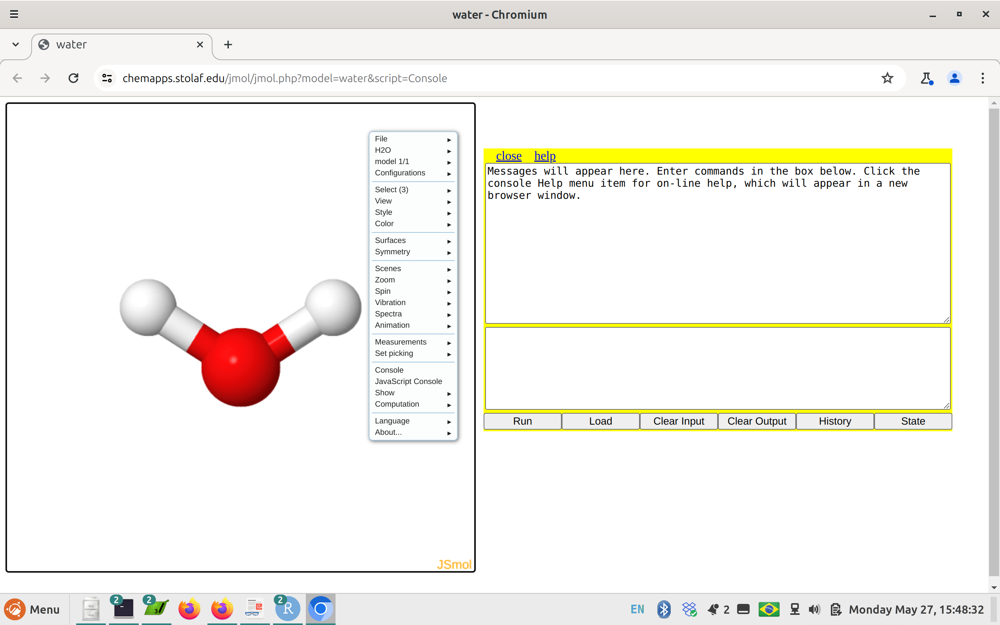

<body style="background-color:  #e6ffff;"> 


<!-- <!-- Google tag (gtag.js) ## se não funcionar o default, tem que colocar essa tag em cada página do sítio--> 
<script async src="https://www.googletagmanager.com/gtag/js?id=G-S1L73VGCG5"></script>
<script>
  window.dataLayer = window.dataLayer || [];
  function gtag(){dataLayer.push(arguments);}
  gtag('js', new Date());

  gtag('config', 'G-S1L73VGCG5');
</script>

<!-- <font size="4"> -->

<!-- {width=20%} -->

|       *Moléculas Voadoras* é apenas um título engraçadinho pra apresentar moléculas de forma tridimensional. Para isso utilizamos um programa de visualização 3D chamado [Jmol](http://jmol.sourceforge.net/). O programa é distribuido livremente  (licença GLPL, GNU Lesser General Public License), e permite uma série de visualizações coloridas, como movimentos de translação e rotação das moléculas, ampliação visual, cálculos de distância, ângulos, estruturas e superfícies, otimizações moleculares, animações, dentre outros.


|       Você pode baixar o programa no *website* acima, ou utilizá-lo diretamente num navegador de internete. Pra exemplificar esse último, abra uma janela em seu navegador (Edge, Firefox, Chrome, etc) e digite o seguinte caminho: vá ao link abaixo:

```{r, eval=FALSE}
https://chemapps.stolaf.edu/jmol/jmol.php?model=water&script=Console
```


|       Arraste a janela *amarela* pra direita, pra você visualizar a molécula, nesse caso, uma *molécula de água*
|       Agora você pode "brincar" à vontade com a molécula. Primeiro, mexendo em seu *mouse* pra fazê-la girar. Pode usar também o botão de rolagem do meio do mouse, pra ampliar ou reduzir seu tamanho na tela. 

|       E pode fazer um montão de outras coisas legais. Pra isso, há duas opções. A primeira envolve o "montão" de coisas por uso de clique de mouse, bastando você clicar com o botão esquerdo desse em qualquer lugar do campo da molécula, como aparece na figura abaixo. 



|       Mas dentro de uma lógica do **Ensino Reprodutível**, contudo, é bem mais chique se utilizar linhas de comando digitados como num bloco de notas. Nesse caso, o *bloco de anotações* é o da janelinha amarela, na parte de baixo. Para utilizá-lo experimente digitar e teclar *Enter* após o seguinte comando:

```{r, eval=F}
spin 50
```


|       Show, não ?! Para fazer a molécula parar de girar, digite:

```{r, eval=F}
spin off
```


|       Se quiser testar outros comandos rápidos com a molécula, experimente os comandos abaixo. Você pode executar um a um, *ou mais de um por vez, separando-os por um ";"*.

```{r, eval=F}
cpk # representação de bola e vareta
wireframe only # representação de arame
background yellow # plano fundo
dots on # nuvens de van der Waals
color magenta # coloração
color cpk # coloração padrão de modelos atômicos
```


|       Existe uma infinidade de comandos que se pode experimentar com uma molécula, e para isso eu sugiro tutorial dirigido também nos moldes de um *Ensino Reprodutível* no [site bioQuanti](https://bioquanti.netlify.app), especificamente no capítulo sobre [comandos do *Jmol*](https://bioquanti.netlify.app/uploads/jmolbook/jmolquarto/comandos).

## Carregando uma molécula armazenada no computador

|       Sem entrar em muitos detalhes, você tem algumas formas para carregar uma molécula de seu interesse no *Jmol online* visto acima. A mais "chique" é por clique e arraste de mouse do arquivo salvo no computador. Para isso, baixe o arquivo abaixo (...quase um pleonasmo) numa pasta qualquer em seu computador.

|       -------> arquivo pra baixar: [aspirina](aspirina.png)

|       Agora clique no arquivo baixado e arraste-o para o site do *Jmol online* em que está a molécula de água. 

|       E Voilá !!!!! A molécula de aspirina é carregada "viva" nas nuvens !!!! E pode ser trabalhada de diversas maneiras, como acima.

|       Existe uma infinidade de moléculas que podem ser baixadas da internete pra se observar e estudar, tais como fármacos, biomoléculas, cristais, e mesmo organismos simples, como vírus inteiros. Seguem alguns exemplos se você quiser experimentar:

1. [Cafeína](cafeina.mol), um poderoso estimulante;
2. [Insulina](insulina.png), a proteína cuja falta está relacionada ao *diabetes*;
3. [Celulose](celulose.png), a principal fonte de carbono do planeta;
4. [Um fago (vírus)](virus.png), dispensa palavras (mas tenha paciência, é grandão e carrega lentamente).

|       Para mais moléculas, sites e truques do *Jmol*, consulte o link correlato, sobre o uso do programa e diversos exemplos no [site bioQuanti](https://bioquanti.netlify.app).


